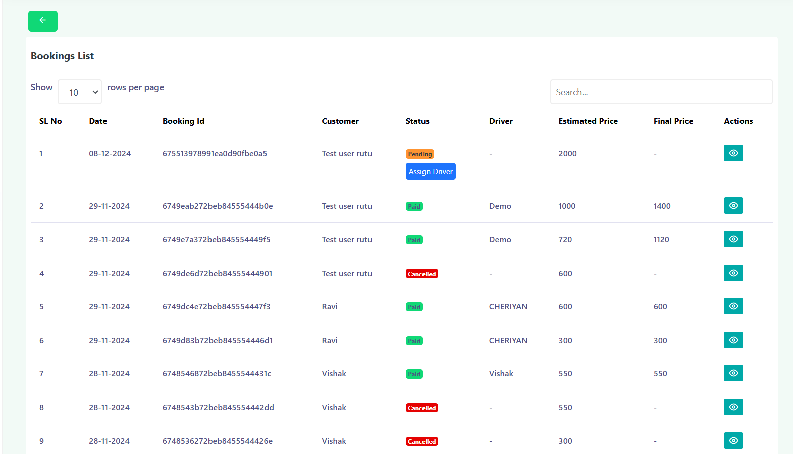
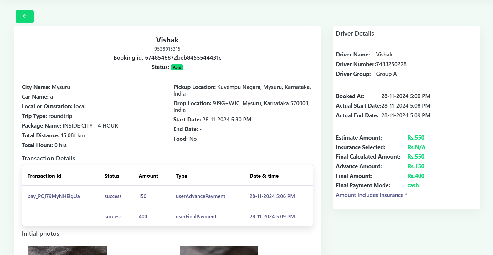
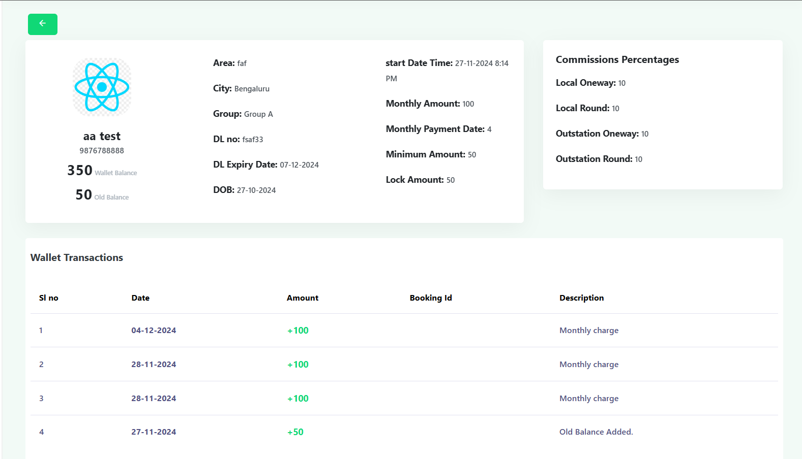
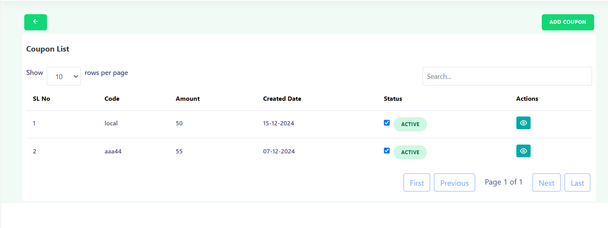
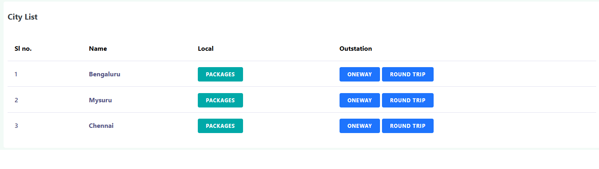

# Vdriv :car:Driver Booking Application

## Overview
The Driver Booking Application is a comprehensive solution designed to facilitate the seamless booking of drivers for various types of trips. Users can book drivers by providing details like date, time, trip type (one-way, round trip, local, or outstation), and location. The platform includes features for secure payments, coupon application, real-time status updates, and automatic cancellation for unfulfilled bookings. Notifications keep users informed at every step. The admin panel offers full control over bookings, allowing admins to assign drivers, cancel bookings, and monitor activity through an interactive dashboard.

## Features

### User Features
- **Driver Booking**: Users can book drivers by entering trip details such as date, time, trip type, and location.
- **Trip Types**:
  - One-way
  - Round trip
  - Local
  - Outstation
- **Payment Integration**: Users can make secure payments through the mobile application.
- **Coupon System**: Users can apply coupons to avail discounts while booking.
- **Booking Status**: Real-time updates for each step of the booking process.
- **Automatic Cancellation**: Bookings are auto-canceled if not confirmed within a specified time.
- **Notifications**: Alerts for booking updates, payment status, and trip reminders.

### Admin Features
- **Booking Management**: Full control to view, assign, or cancel bookings.
- **Driver Management**: Add, manage drivers and their wallet.
- **Dashboard**: Monitor overall activity, track metrics, and manage operations efficiently.
- **Notifications**: Admins receive alerts for pending actions, cancellations, and updates.
- **Coupons**: Create and manage coupons.
- **Pacakges**: Create and manage the packages for different cities.

## Technologies Used
- **Backend**: Node.js, Express.js, node-cron, redis & bul-mq (for auto-cancel)
- **Database**: MongoDB
- **Frontend**: React.js (Web Application)
- **Notifications**: Push notifications with firebase.
- **Mobile Application**: Flutter (Mobile App Developer)

## Screenshots
### Web Application

### Mobile Application

## Future Enhancements
- **User Reviews**: Allow users to rate drivers.
- **Live Tracking**: Real-time tracking of drivers during the trip.
- **Advanced Analytics**: Enhance admin dashboard with predictive analytics.

---

